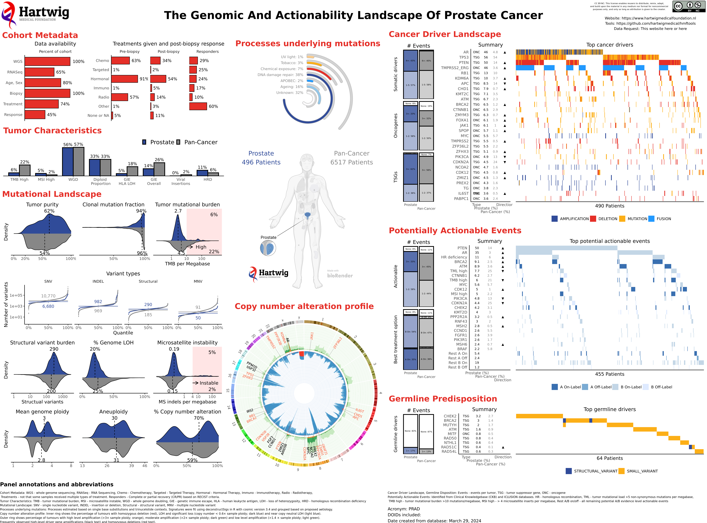

## Vignettes

This repo contains the workflow to create cancer vignettes from Hartwig mysql database. 

## High-level main steps 
- Specify cohorts to create vignettes (short summaries). 
- Query data from mySQL HMF data base. 
- Prepare underlying data for downstream figure creation. 
- Create figures.
- Format figures together to build vignettes.

## How to run?
- From root directory: python run.py
- Database will be queried, data prepared, figures created, and vignettes built
- Time stamps added to vignettes correspond to date database was queried.

## Folders

### mission_control
- Contains all the configuration files for colors, themes, file locations. 
- run_config.r - specifies the cohort definitions to create vignettes.

### 0_queries
- Stores all queries of Hartwig mysql database
- Tables queried: (hmfpatients) baseline, biopsy, chord, clinical, copyNumber, datarequest_all, doidNode, driverCatalog, geneCopyNumber, geneExpression, patientId, protect, purity, sample, signature, somaticVariant, svAnnotation, svCluster, structuralVariant, svFusion, treatmentResponse, virusAnnotation, (treatment) patientId, (drug) patientId
- To run all: ./0_queries/run.sh
- All queries take about 5 hours to finish (somaticVariant table takes several hours)

### 1_prep
- Only include data included in datarequest_all table. 
- If duplicate samples per patient, only keep sample with highest purity

### 2_figures
- Folder contains all code to create ggplot figures

### 3_build
- Setting of themes, titles, legends, spacing in the figures
- Organizing figures per cohort into vignette images.
